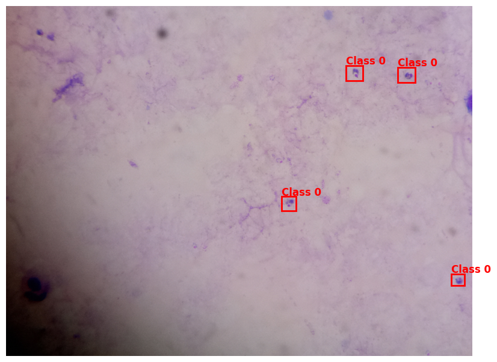
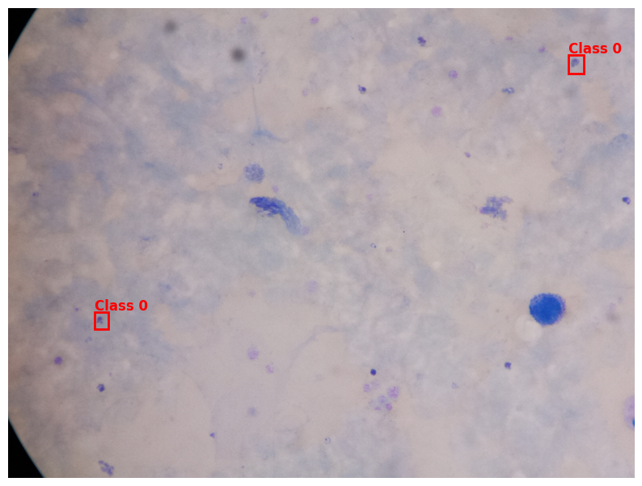
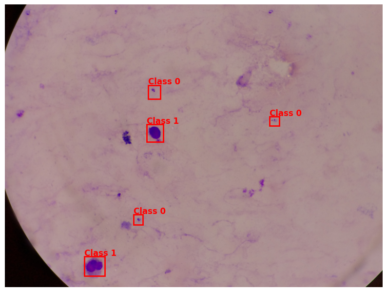
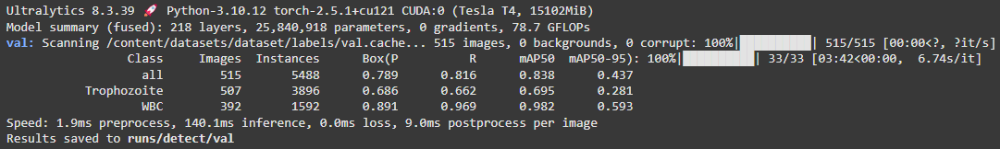

# Malaria Detection Using Computer Vision

My first computer vision project, this was made as a submission to a contest hosted on Zindi. The notebooks and files were provided by the organizers of the project, and the training was on Colab.

## Training Process

The training process involved:

1. Taking blood samples of Malaria.
2. Mapping bounding boxes onto the samples.
3. Analyzing the images inside the boxes.

### Sample Images

## Results

After training, I checked the accuracy of the data using the given `test.csv` file, resulting in the following scores:

- **Class:** all
- **Images:** 515
- **Instances:** 5488
- **P:** 0.789
- **R:** 0.816
- **mAP50:** 0.838
- **mAP50-95:** 0.437

- **Class:** Trophozoite
- **Images:** 507
- **Instances:** 3896
- **P:** 0.686
- **R:** 0.662
- **mAP50:** 0.695
- **mAP50-95:** 0.281

- **Class:** WBC
- **Images:** 392
- **Instances:** 1592
- **P:** 0.891
- **R:** 0.969
- **mAP50:** 0.982
- **mAP50-95:** 0.593

Finally, the results were submitted successfully with a public score of 0.42 and private score of 0.39.

This score could've been increased by training with more epochs and tuning the data more, although such actions may result in higher usage fees.

## Conclusion

Overall, this was a fun experience and an interesting start in computer vision. I look forward to doing other similar projects in the future.
